非常好！我来为您补充包含Web呈现逻辑的完整架构图。基于您的代码，我看到了一个完整的前端架构，让我将其整合到数据流图中：

```mermaid
graph TD
    subgraph External ["外部数据源 (External World)"]
        DS1["📰 媒体新闻"]
        DS2["📚 学术论文"]
        DS3["⚖️ 专利数据"]
        DS4["💻 开源项目"]
        DS5["👥 人才招聘"]
        DS6["📊 投资分析师报告"]
        DS7["🎓 学术顶会"]
        DS8["🏢 产业顶会"]
    end

    subgraph Config ["配置与驱动层 (Configuration & Drivers)"]
        A["ENTITIES集合<br/>知识图谱节点<br/>🔄 status: active/inactive"]
        A1["⚙️ 技术实体<br/>status=active"]
        A2["🏢 公司实体<br/>status=active"]
        A --> A1
        A --> A2
    end

    subgraph Collection ["采集层 (Collection Layer - 双轮驱动)"]
        C1["♻️ 技术驱动采集器"]
        C2["🏭 公司驱动采集器"]
        A1 --> C1
        A2 --> C2

        C1 --> DS1
        C1 --> DS2
        C1 --> DS3
        C1 --> DS4
        C1 --> DS7

        C2 --> DS1
        C2 --> DS5
        C2 --> DS6
        C2 --> DS8
    end

    subgraph Buffer ["缓冲与处理层 (Buffer & Processing Layer)"]
        B["RAW_DATA_TASK_QUEUE<br/>任务队列-解耦与缓冲<br/>📋 status: pending/processing/completed"]
        P["🖥️ 中央处理流水线<br/>Apps Script / Cloud Function"]
        
        P1["1-按类型分组<br/>📊 grouped"]
        P2["2-专属AI批处理<br/>🤖 ai_processed"]
        P3["3-统一实体链接<br/>🔗 entity_linked"]
        P4["4-统一向量化<br/>🧮 vectorized"]
        P5["5-证据链构建<br/>⛓️ evidence_built"]

        P --> P1 --> P2 --> P3 --> P4 --> P5
        B --> P
    end

    C1 --> B
    C2 --> B

    subgraph Storage ["最终存储层 (Final Storage Layer)"]
        D_EVIDENCE["证据库Evidence<br/>处理后的原始数据<br/>📝 status: raw/processed/archived"]
        D1["RAW_TECH_NEWS集合<br/>🔄 processing_status<br/>📅 last_updated<br/>🏷️ data_quality_score"]
        D2["RAW_ACADEMIC_PAPERS集合<br/>🔄 processing_status<br/>📅 last_updated<br/>🏷️ data_quality_score"]
        D3["RAW_TALENT_FLOW集合<br/>🔄 processing_status<br/>📅 last_updated<br/>🏷️ data_quality_score"]
        D8["RAW_ACADEMIC_CONF集合<br/>🔄 processing_status<br/>📅 last_updated<br/>🏷️ data_quality_score"]
        D9["RAW_INDUSTRY_CONF集合<br/>🔄 processing_status<br/>📅 last_updated<br/>🏷️ data_quality_score"]
        D10["RAW_PATENTS集合<br/>🔄 processing_status<br/>📅 last_updated<br/>🏷️ data_quality_score"]
        D11["RAW_OPEN_SOURCE集合<br/>🔄 processing_status<br/>📅 last_updated<br/>🏷️ data_quality_score"]
        D12["RAW_INVESTMENT_REPORTS集合<br/>🔄 processing_status<br/>📅 last_updated<br/>🏷️ data_quality_score"]
        
        D_EVIDENCE --> D1
        D_EVIDENCE --> D2
        D_EVIDENCE --> D3
        D_EVIDENCE --> D8
        D_EVIDENCE --> D9
        D_EVIDENCE --> D10
        D_EVIDENCE --> D11
        D_EVIDENCE --> D12

        D_INSIGHT["洞察库Insight<br/>标准化的情报卡片<br/>💡 status: draft/reviewed/published"]
        D4["TECH_INSIGHTS_MASTER集合<br/>🔄 insight_status<br/>📊 confidence_score<br/>👤 reviewer_id<br/>📅 publish_date"]
        D_INSIGHT --> D4

        D_KG["知识图谱KnowledgeGraph<br/>网络化价值<br/>🕸️ status: building/stable/updating"]
        D5["ENTITIES集合-节点<br/>🔄 entity_status<br/>📈 importance_score<br/>🔗 connection_count"]
        D6["RELATIONSHIPS集合-边<br/>🔄 relation_status<br/>💪 strength_score<br/>📅 last_verified"]
        D_KG --> D5
        D_KG --> D6
        
        D_ANALYTICS["分析快照Analytics<br/>趋势分析数据<br/>📈 status: generating/ready/stale"]
        D7["ENTITY_DAILY_SNAPSHOTS集合<br/>🔄 snapshot_status<br/>📅 snapshot_date<br/>📊 metrics_complete"]
        D_ANALYTICS --> D7
    end

    %% 主要数据流与状态迁移
    P5 --> D_EVIDENCE
    D_EVIDENCE --> D_INSIGHT
    
    %% 原始数据源与存储的对应关系（虚线）
    DS1 -.-> D1
    DS2 -.-> D2
    DS3 -.-> D10
    DS4 -.-> D11
    DS5 -.-> D3
    DS6 -.-> D12
    DS7 -.-> D8
    DS8 -.-> D9
    
    subgraph PostProcess ["后处理工作流 (Post-Processing Workflows)"]
        W1["关系构建器<br/>🔄 workflow_status<br/>📅 last_run<br/>⏱️ next_schedule"]
        W2["技术树构建器<br/>🔄 workflow_status<br/>📅 last_run<br/>⏱️ next_schedule"]
        W3["每日快照生成器<br/>🔄 workflow_status<br/>📅 last_run<br/>⏱️ next_schedule"]
    end
    
    %% 状态迁移流程
    D_INSIGHT -->|"status: draft→reviewed"| W1
    W1 -->|"status: reviewed→published"| D_KG
    
    A -->|"定期扫描 status: active"| W2
    W2 -->|"更新 entity_status"| A

    D_INSIGHT -->|"每日聚合 status: ready"| W3
    W3 -->|"生成 snapshot_status: ready"| D_ANALYTICS

    %% ========== 新增：Web呈现层 ==========
    subgraph WebLayer ["Web呈现层 (Web Presentation Layer)"]
        subgraph BackendAPI ["后端API层"]
            API_AUTH["AuthService<br/>用户认证与权限"]
            API_DASH["DashboardService<br/>仪表盘数据聚合"]
            API_EXPL["ExplorationService<br/>探索功能API"]
            API_ANAL["AnalysisService<br/>分析功能API"]
            API_FIND["FindingsService<br/>成果管理API"]
            API_COPI["CopilotService<br/>AI助手API"]
            API_SYS["SystemAdminService<br/>系统管理API"]
        end
        
        subgraph FrontendCore ["前端核心层"]
            APP_MAIN["App主控制器<br/>路由与状态管理"]
            PAGE_HOME["HomePage模块<br/>仪表盘页面"]
            PAGE_EXPL["ExplorationPage模块<br/>探索中心页面"]
            PAGE_ANAL["AnalysisPage模块<br/>分析中心页面"]
            PAGE_FIND["FindingsPage模块<br/>成果中心页面"]
            PAGE_COPI["CopilotPage模块<br/>AI助手页面"]
            PAGE_SYS["SystemPage模块<br/>系统管理页面"]
        end
        
        subgraph UIComponents ["UI组件层"]
            UI_CHART["ECharts图表组件<br/>📊 市场雷达图<br/>📈 趋势分析图<br/>🕸️ 关系网络图"]
            UI_3D["Three.js 3D组件<br/>🌌 星系图渲染<br/>🔮 时空可视化"]
            UI_FORM["表单组件<br/>🔍 TomSelect搜索<br/>📝 输入验证"]
            UI_MODAL["模态框组件<br/>💬 详情面板<br/>⚙️ 设置弹窗"]
            UI_UTILS["工具函数<br/>🍞 Toast通知<br/>📸 截图保存<br/>🎨 主题切换"]
        end
    end

    %% 数据流：存储层 → API层
    D_EVIDENCE --> API_DASH
    D_INSIGHT --> API_DASH
    D_KG --> API_DASH
    D_ANALYTICS --> API_DASH
    
    D_EVIDENCE --> API_EXPL
    D_KG --> API_EXPL
    
    D_KG --> API_ANAL
    D_ANALYTICS --> API_ANAL
    
    D_INSIGHT --> API_FIND
    D_ANALYTICS --> API_FIND
    
    D_KG --> API_COPI
    D_INSIGHT --> API_COPI
    
    A --> API_SYS
    
    %% 数据流：API层 → 前端页面
    API_AUTH --> APP_MAIN
    API_DASH --> PAGE_HOME
    API_EXPL --> PAGE_EXPL
    API_ANAL --> PAGE_ANAL
    API_FIND --> PAGE_FIND
    API_COPI --> PAGE_COPI
    API_SYS --> PAGE_SYS
    
    %% 前端页面 → UI组件
    PAGE_HOME --> UI_CHART
    PAGE_EXPL --> UI_3D
    PAGE_ANAL --> UI_CHART
    PAGE_FIND --> UI_MODAL
    PAGE_COPI --> UI_FORM
    PAGE_SYS --> UI_FORM
    
    %% 所有页面都可能使用工具函数
    PAGE_HOME --> UI_UTILS
    PAGE_EXPL --> UI_UTILS
    PAGE_ANAL --> UI_UTILS
    PAGE_FIND --> UI_UTILS
    PAGE_COPI --> UI_UTILS
    PAGE_SYS --> UI_UTILS

    %% ========== 用户交互流 ==========
    subgraph UserFlow ["用户交互流"]
        USER["👤 用户"]
        BROWSER["🌐 浏览器"]
        
        USER --> BROWSER
        BROWSER --> APP_MAIN
    end

    %% 状态监控反馈到Web层
    subgraph Monitor ["状态监控层"]
        M1["📊 数据质量监控<br/>quality_threshold: 0.8"]
        M2["⚠️ 异常检测<br/>alert_threshold: 0.95"]
        M3["📈 性能监控<br/>latency_threshold: 5s"]
    end

    D_EVIDENCE -.->|"质量检查"| M1
    D_INSIGHT -.->|"异常检测"| M2
    PostProcess -.->|"性能监控"| M3
    
    %% 监控结果反馈到前端
    M1 -.-> API_SYS
    M2 -.-> API_SYS
    M3 -.-> API_SYS

    %% ========== 特殊功能流 ==========
    %% AI Copilot深度研究流
    API_COPI -->|"调用分析服务"| API_ANAL
    API_COPI -->|"调用探索服务"| API_EXPL
    
    %% 快照保存流
    UI_UTILS -->|"html2canvas截图"| API_FIND
    
    %% 实时数据更新流
    W3 -->|"推送更新"| API_DASH
    
    %% 样式定义
    classDef configStyle fill:#e6f3ff,stroke:#0066cc,stroke-width:2px
    classDef bufferStyle fill:#fff2cc,stroke:#ff9900,stroke-width:2px
    classDef processStyle fill:#e5fce5,stroke:#33cc33,stroke-width:2px
    classDef storageStyle fill:#fde0e0,stroke:#c04040,stroke-width:1px
    classDef externalStyle fill:#f0f0f0,stroke:#666666,stroke-width:1px
    classDef academicStyle fill:#e8f4fd,stroke:#1976d2,stroke-width:2px
    classDef industryStyle fill:#fff3e0,stroke:#f57c00,stroke-width:2px
    classDef webStyle fill:#f3e5f5,stroke:#9c27b0,stroke-width:2px
    classDef apiStyle fill:#e8f5e8,stroke:#4caf50,stroke-width:2px
    classDef uiStyle fill:#fff3e0,stroke:#ff9800,stroke-width:2px
    
    class A,A1,A2 configStyle
    class B bufferStyle
    class P,P1,P2,P3,P4,P5 processStyle
    class D_EVIDENCE,D_INSIGHT,D_KG,D_ANALYTICS storageStyle
    class DS1,DS2,DS3,DS4,DS5,DS6 externalStyle
    class DS7,D8 academicStyle
    class DS8,D9 industryStyle
    class APP_MAIN,PAGE_HOME,PAGE_EXPL,PAGE_ANAL,PAGE_FIND,PAGE_COPI,PAGE_SYS webStyle
    class API_AUTH,API_DASH,API_EXPL,API_ANAL,API_FIND,API_COPI,API_SYS apiStyle
    class UI_CHART,UI_3D,UI_FORM,UI_MODAL,UI_UTILS uiStyle
```

**主要新增的Web呈现层架构说明：**

## **1. 后端API层 (Backend API Layer)**
- **AuthService**: 处理用户认证、权限验证、用户关注管理
- **DashboardService**: 聚合仪表盘所需的各种数据（市场雷达、雅典娜简报、新兴信号等）
- **ExplorationService**: 提供探索功能（星系图数据、实体搜索、主题信息流等）
- **AnalysisService**: 支持分析功能（关系网络、演进轨迹、生态位分析等）
- **FindingsService**: 管理研究成果（技术线索、报告、快照等）
- **CopilotService**: AI助手的深度研究功能
- **SystemAdminService**: 系统管理功能（注册表管理、用户管理等）

## **2. 前端核心层 (Frontend Core Layer)**
- **App主控制器**: 负责路由管理、页面切换、全局状态管理
- **各页面模块**: 每个页面都是独立的模块，负责特定功能的呈现和交互逻辑

## **3. UI组件层 (UI Components Layer)**
- **ECharts图表组件**: 市场雷达图、趋势分析图、关系网络图等
- **Three.js 3D组件**: 星系图渲染、时空可视化
- **表单组件**: TomSelect搜索、输入验证等
- **模态框组件**: 详情面板、设置弹窗等
- **工具函数**: Toast通知、截图保存、主题切换等

## **4. 特殊数据流**
- **AI Copilot深度研究流**: CopilotService可以调用其他服务获取数据进行综合分析
- **快照保存流**: 前端使用html2canvas截图后通过API保存到FindingsService
- **实时数据更新流**: 后处理工作流的结果可以推送到前端进行实时更新
- **监控反馈流**: 系统监控结果可以在前端系统管理页面中展示

这个架构图现在完整地展示了从数据采集、处理、存储到最终Web呈现的全链路，每个层次都有明确的职责分工和数据流向。
