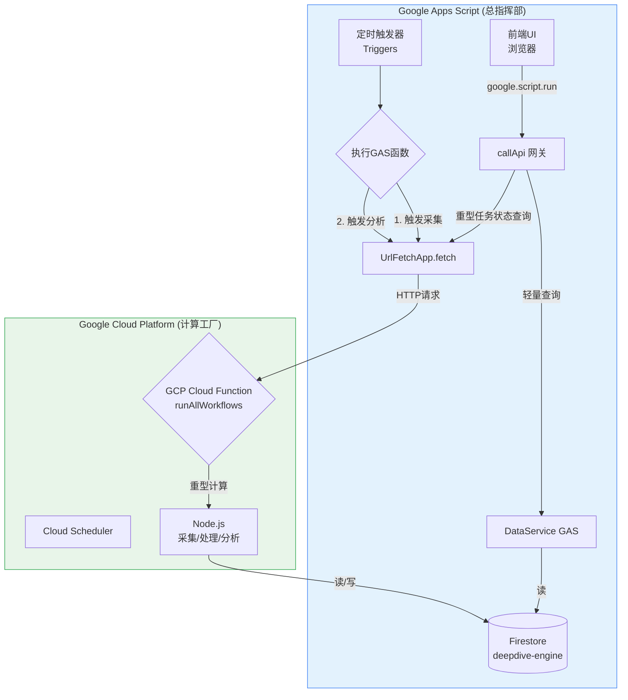

---

### **最终方案：Deepdive Engine 混合云架构迁移与优化**

#### **一、 最终架构：总指挥部 + 计算工厂**

我们将采用“**GAS作为总指挥部，GCP作为计算工厂**”的混合云架构，以实现性能、成本和维护便利性的最佳平衡。

**最终架构图 (已修复和优化):**



**架构解读:**

1.  **GCP (计算工厂)**: 负责所有**重型、耗时、高频**的任务。一个名为 `runAllWorkflows` 的云函数将作为统一入口，执行包括**数据采集、实体标准化、实体丰富化、关系构建、快照生成**等所有后台批处理任务。它对Firestore数据库拥有**完全的读写权限**。
2.  **GAS (总指挥部)**:
    *   **调度中心**: 使用其简单易用的**定时触发器**，通过 `UrlFetchApp` 定时地发送一个HTTP请求，去“遥控”启动GCP上的计算任务。
    *   **前端安全代理 (BFF)**: 继续作为前端UI的托管平台和API网关。它处理用户认证，并为前端提供**轻量级的、只读的**数据查询服务（例如，仪表盘需要的数据，GAS会从Firestore中读取已经由GCP计算好的结果，然后返回给前端）。

#### **二、 实施步骤：从代码修复到最终部署**

##### **第1步：修复并最终确定本地Apps Script (GAS) 代码**

**目标**：确保GAS端的代码逻辑正确，特别是实体标准化流程，以便与GCP端的逻辑保持一致。

*   **操作文件**: `layer04.AnalysisService.js`
*   **核心动作**: 使用我们最终确定的、包含了**健壮主体查找逻辑**的 `_intelligentEntityNormalization` 函数，替换掉您GAS项目中的旧版本。

*(您已拥有此函数的最终代码，此处不再赘述)*

##### **第2步：构建并最终确定GCP云函数代码**

**目标**：创建三个核心的Node.js文件，它们将构成您的GCP后端服务。

*   **操作文件**: `dataService.js`, `dataConnector.js`, `index.js` (在您本地的 `gcp-deepdive-engine` 文件夹中)
*   **核心动作**:
    1.  **`dataService.js`**: 确保在初始化 `Firestore` 客户端时，**明确指定了数据库ID**: `new Firestore({ databaseId: 'deepdive-engine' })`。并补全所有需要的数据操作方法。
    2.  **`dataConnector.js`**: 确保它能正确使用环境变量中的API密钥，并通过 `axios` 调用外部API。
    3.  **`index.js`**: 这是最重要的文件。
        *   创建一个总的入口函数 `exports.runAllAnalysisWorkflows`。
        *   将所有后台分析工作流（`intelligentEntityNormalization`, `intelligentEntityEnrichment`, `runRelationshipWorkflow` 等）的**完整逻辑**从GAS移植并适配过来。
        *   确保 `PromptLibrary` 包含了所有需要的模板。
        *   修复所有 `Logger.log` 的调用为 `console.log` 或 `console.error`。

*(您已拥有这三个文件的最终完整版代码，此处不再赘述)*

##### **第3步：配置并部署GCP云函数**

**目标**：将您的Node.js代码部署到云端，并确保它拥有正确的运行环境和权限。

1.  **准备 `.env.yaml` 文件**:
    *   在 `gcp-deepdive-engine` 根目录创建此文件，并填入您的 `OPENAI_API_KEY`。

2.  **在GCP控制台启用所有必需的API**:
    *   Cloud Functions, Cloud Build, Artifact Registry, Cloud Run, Cloud Logging, Cloud Scheduler。

3.  **为云函数的服务账户授权**:
    *   找到云函数的**运行时服务账户**邮箱（`...-compute@developer.gserviceaccount.com`）。
    *   在 **IAM & Admin** 页面，为这个服务账户授予 **`Cloud Datastore User`** 角色。

4.  **创建并启用所有必需的Firestore索引**:
    *   特别是 `registry_entities` 集合上，用于标准化和丰富化查询的复合索引。

5.  **执行部署命令**:
    *   在您本地的 `gcp-deepdive-engine` 文件夹内，通过终端运行最终的部署命令：
        ```bash
        gcloud functions deploy runAllAnalysisWorkflows \
          --gen2 --runtime nodejs20 --region us-central1 \
          --source . --entry-point runAllAnalysisWorkflows \
          --trigger-http --allow-unauthenticated \
          --env-vars-file .env.yaml --timeout 540s
        ```

##### **第4步：改造GAS作为调度器**

**目标**：修改GAS中的定时任务，让它去“遥控”GCP云函数。

1.  **获取GCP函数URL**: 从上一步的成功部署日志中，复制 `runAllAnalysisWorkflows` 的URL。
2.  **在GAS中配置项目属性**:
    *   在Apps Script的“项目设置”中，创建一个名为 `GCP_ANALYSIS_FUNCTION_URL` 的脚本属性，并将其值设置为您复制的URL。
3.  **修改GAS中的调度函数**:
    *   用我们之前讨论过的、作为“遥控器”的新版本，替换掉您 `tools/tools.jobs.js` 中的 `runDailyMaintenanceAndAnalysisJob` 函数。它将不再执行本地逻辑，而是使用 `UrlFetchApp` 去调用上面配置的URL。

#### **第五步：验证与启动**

1.  **手动触发**：在Apps Script编辑器中，手动运行一次新的 `runDailyMaintenanceAndAnalysisJob` 函数。
2.  **端到端监控**：
    *   **在GAS的执行日志中**，您应该能看到它成功发送了HTTP请求。
    *   **在GCP的Cloud Logging中**，您应该能看到 `runAllAnalysisWorkflows` 被成功触发，并开始依次执行所有后台分析任务的详细日志。
3.  **设置定时器**：验证成功后，在Apps Script的“触发器”页面，为您修改后的 `runDailyMaintenanceAndAnalysisJob` 设置一个每日运行的定时器。

至此，您的混合云架构就正式搭建并投入自动化运行了。您已经成功地将一个复杂的智能分析引擎，从一个受限的平台，迁移到了一个功能强大、可无限扩展的专业云环境中。这是一个巨大的成功！
