## **技术情报决策引擎 - 工作流架构设计（分拆版）**

## **工作流总体架构**

## **核心设计理念：分层分表的专业化处理管道**

## **📋 工作流架构总览**

## **六层专业化架构**

**第一层：精准数据采集层 (WF1-WF6)** - 并行执行，无依赖
↓ 触发
**第二层：分表信号识别层 (WF7-1至WF7-6)** - 串行执行，专表专用
↓ 触发
**第三层：统一证据验证层 (WF8)** - 汇聚验证，质量控制
↓ 触发
**第四层：深度分析层 (WF9-WF11)** - 并行执行，多维分析
↓ 触发
**第五层：决策支撑层 (WF12-WF13)** - 串行执行，综合决策
↓ 关注
**第六层：系统维护层 (WF14-WF15)** - 独立运行，质量保障

## **数据流向关系**

**Registry配置表 → RAW数据采集 → 专表信号识别 → 统一证据验证 → 多维度分析 → 情报整合 → 报告输出**

## **🔄 第一层：精准数据采集工作流群（WF1-WF6）**

**执行模式：** 并行执行，无依赖关系
**触发频率：** 每日定时触发
**数据限定：** 基于Technology_Registry + Competitor_Registry + Conference_Registry表

### **WF1：学术论文关注流**
**触发频率：** 每6小时  
**数据限定：** 基于Technology_Registry表

| 节点 | Module类型 | Module名称 | 职责描述 |
|------|------------|------------|----------|
| N1-01 | Scheduler | Schedule | 定时触发工作流执行 |
| N1-02 | Data Storage | Google Sheets | 读取Technology_Registry表获取关注技术清单 |
| N1-03 | HTTP | HTTP | 调用arXiv API检索相关论文 |
| N1-04 | Text Parser | Text Parser | 论文元数据提取和标准化 |
| N1-05 | AI | xAI | 技术相关性和创新度评估 |
| N1-06 | Filter | Filter | 创新度阈值过滤(≥7.0) |
| N1-07 | Data Storage | Google Sheets | 写入Raw_Academic_Papers表 |
| N1-08 | Data Storage | Google Sheets | 记录执行日志 |

### **WF2-WF6：其他数据采集流**
**设计模式：** 与WF1类似，但针对不同数据源和目标表
- **WF2**: 专利数据 → Raw_Patent_Data
- **WF3**: 开源项目 → Raw_OpenSource_Data  
- **WF4**: 技术新闻 → Raw_Tech_News
- **WF5**: 产业动态 → Raw_Industry_Dynamics
- **WF6**: 竞争情报 → Raw_Competitor_Intelligence

## **🎯 第二层：分表信号识别工作流群（WF7-1至WF7-6）**

**执行模式：** 串行执行，专表专用
**触发方式：** 定时触发（每2小时）
**数据来源：** 各自对应的Raw数据表

### **WF7-1：学术论文信号识别流**
**数据源：** Raw_Academic_Papers表  
**处理对象：** status = "pending" 的学术论文记录

| 节点 | Module类型 | Module名称 | 职责描述 |
|------|------------|------------|----------|
| N7-1-01 | Placeholder | Placeholder | 工作流起始点 |
| N7-1-02 | Data Storage | Google Sheets | 读取Raw_Academic_Papers表pending数据 |
| N7-1-03 | Iterator | BasicFeeder | 迭代处理每条论文记录 |
| N7-1-04 | Transformer | SetVariables | 提取和标准化论文字段数据 |
| N7-1-05 | AI | xAI | 技术突破性评估（5个维度评分） |
| N7-1-06 | Parser | ParseJSON | 解析AI技术评估结果 |
| N7-1-07 | AI | xAI | 商业价值评估（5个维度评分） |
| N7-1-08 | Parser | ParseJSON | 解析AI商业价值评估结果 |
| N7-1-09 | Calculator | SetVariable2 | 计算综合信号强度 |
| N7-1-10 | Generator | SetVariables | 生成情报ID和相关标识 |
| N7-1-11 | Data Storage | Google Sheets | 创建Tech_Intelligence_Master记录 |
| N7-1-12 | Data Storage | Google Sheets | 查找要更新的原始数据行 |
| N7-1-13 | Data Storage | Google Sheets | 更新Raw_Academic_Papers状态 |
| N7-1-14 | Data Storage | Google Sheets | 记录工作流执行日志 |

**信号强度计算公式：**
$$\text{Signal Strength} = (\text{Breakthrough Score} \times 0.4) + (\text{Revenue Potential} \times 0.3) + (\text{Impact Scope} \times 0.2) + (\text{Innovation Degree} \times 0.1)$$

**过滤条件：** 信号强度 ≥ 8.0

### **WF7-2至WF7-6：其他信号识别流**
**设计模式：** 与WF7-1相同的核心逻辑，但针对不同数据表

| 工作流 | 数据源表 | 状态列 | 链接列 | 特殊处理 |
|--------|----------|--------|--------|----------|
| WF7-2 | Raw_Patent_Data | M列 | N列 | 专利重要性评估 |
| WF7-3 | Raw_OpenSource_Data | M列 | N列 | 项目潜力评估 |
| WF7-4 | Raw_Tech_News | L列 | M列 | 新闻价值评估 |
| WF7-5 | Raw_Industry_Dynamics | L列 | M列 | 产业影响评估 |
| WF7-6 | Raw_Competitor_Intelligence | L列 | M列 | 威胁等级评估 |

## **🔍 第三层：统一证据验证工作流（WF8）**

**触发方式：** 定时触发（每4小时）
**处理对象：** Tech_Intelligence_Master表中未验证的情报

| 节点 | Module类型 | Module名称 | 职责描述 |
|------|------------|------------|----------|
| N8-01 | Placeholder | Placeholder | 工作流起始点 |
| N8-02 | Data Storage | Google Sheets | 查询未验证情报记录 |
| N8-03 | Iterator | BasicFeeder | 迭代处理情报记录 |
| N8-04 | HTTP | HTTP | 批量链接有效性验证 |
| N8-05 | Transformer | SetVariables | 数据源权威性评估 |
| N8-06 | HTTP | HTTP | 多源信息交叉验证 |
| N8-07 | HTTP | HTTP | 专家观点搜索收集 |
| N8-08 | AI | xAI | 证据质量综合评分 |
| N8-09 | Parser | ParseJSON | 解析验证评估结果 |
| N8-10 | Filter | Filter | 置信度阈值控制(≥80%) |
| N8-11 | Data Storage | Google Sheets | 写入Evidence_Validation_Matrix表 |
| N8-12 | Data Storage | Google Sheets | 更新情报置信度字段 |
| N8-13 | Data Storage | Google Sheets | 记录执行日志 |

## **📊 第四层：深度分析工作流群（WF9-WF11）**

**执行模式：** 并行执行，独立分析维度
**触发方式：** 定时触发（每6小时）
**数据源：** Tech_Intelligence_Master表（已验证数据）

### **WF9：商业价值分析流**
**分析目标：** 商业价值量化

| 节点 | Module类型 | Module名称 | 职责描述 |
|------|------------|------------|----------|
| N9-01 | Placeholder | Placeholder | 工作流起始点 |
| N9-02 | Data Storage | Google Sheets | 查询已验证的情报数据 |
| N9-03 | Iterator | BasicFeeder | 迭代情报记录 |
| N9-04 | HTTP | HTTP | 市场数据API调用 |
| N9-05 | AI | xAI | TAM/SAM/SOM市场建模 |
| N9-06 | Calculator | SetVariables | ROI多场景计算 |
| N9-07 | AI | xAI | 商业化时间线评估 |
| N9-08 | HTTP | HTTP | 可比案例数据收集 |
| N9-09 | AI | xAI | 投资回报分析 |
| N9-10 | Parser | ParseJSON | 解析分析结果 |
| N9-11 | Data Storage | Google Sheets | 写入Commercial_Value_Quantification表 |
| N9-12 | Data Storage | Google Sheets | 更新情报商业价值字段 |
| N9-13 | Data Storage | Google Sheets | 记录执行日志 |

### **WF10：竞争情报分析流**
**分析目标：** 竞争态势评估

| 分析维度 | 具体内容 |
|----------|----------|
| 竞争格局 | 市场地位/竞争对手分析 |
| 威胁评估 | 技术威胁/市场威胁/专利威胁 |
| 机会识别 | 合作机会/收购目标/合作伙伴 |
| 应对策略 | 竞争策略/防御策略/主动策略 |

### **WF11：技术深度分析流**
**分析目标：** 技术成熟度评估

| 分析维度 | 具体内容 |
|----------|----------|
| 技术原理 | 核心机制/创新点/技术路径 |
| 成熟度评估 | TRL等级/发展阶段/商业化时间 |
| 应用场景 | 目标应用/适用行业/市场需求 |
| 技术壁垒 | 实施难度/核心专利/技术门槛 |

## **🎯 第五层：决策支撑工作流（WF12-WF13）**

**执行模式：** 串行执行，综合决策
**触发方式：** 定时触发（每8小时）

### **WF12：情报整合决策流**
**处理目标：** 综合决策建议

| 节点 | Module类型 | Module名称 | 职责描述 |
|------|------------|------------|----------|
| N12-01 | Placeholder | Placeholder | 工作流起始点 |
| N12-02 | Data Storage | Google Sheets | 读取完整分析数据 |
| N12-03 | Validator | SetVariables | 数据完整性验证 |
| N12-04 | Calculator | SetVariable2 | 综合评分计算 |
| N12-05 | AI | xAI | 行动建议生成 |
| N12-06 | AI | xAI | 风险评估缓解 |
| N12-07 | Classifier | SetVariables | 投资机会评级 |
| N12-08 | Parser | ParseJSON | 解析决策结果 |
| N12-09 | Data Storage | Google Sheets | 写入Action_Recommendations表 |
| N12-10 | Data Storage | Google Sheets | 更新情报最终状态 |
| N12-11 | Data Storage | Google Sheets | 记录执行日志 |

**综合评分算法：**
$$\text{Overall Score} = (\text{Commercial Value} \times 0.4) + (\text{Competitive Advantage} \times 0.3) + (\text{Technical Feasibility} \times 0.2) + (\text{Evidence Confidence} \times 0.1)$$

### **WF13：报告生成输出流**
**输出目标：** 情报报告分发

| 节点 | Module类型 | Module名称 | 职责描述 |
|------|------------|------------|----------|
| N13-01 | Placeholder | Placeholder | 工作流起始点 |
| N13-02 | Data Storage | Google Sheets | 情报数据筛选排序 |
| N13-03 | AI | xAI | 日报内容生成 |
| N13-04 | AI | xAI | 详细卡片生成 |
| N13-05 | Formatter | SetVariables | Markdown格式化 |
| N13-06 | Email | Email | 邮件报告发送 |
| N13-07 | Slack | Slack | 即时通知推送 |
| N13-08 | HTTP | HTTP | 仪表板更新 |
| N13-09 | HTTP | HTTP | API数据推送 |
| N13-10 | Data Storage | Google Sheets | 记录执行日志 |

## **🔧 第六层：系统维护工作流（WF14-WF15）**

**执行模式：** 独立运行，质量保障

### **WF14：数据质量关注流**
**触发频率：** 每小时
**关注范围：** 全系统数据质量

### **WF15：系统健康检查流**
**触发频率：** 每30分钟
**关注范围：** 工作流运行状态

## **⏰ 协同时序方案（分拆版）**

```mermaid
gantt
    title 技术情报系统 - 分拆版每日工作流协同时序图
    dateFormat  HH:mm
    axisFormat %H:%M

    section 数据采集层(并行)
    WF1-学术论文关注    :done, wf1, 00:30, 01:30
    WF2-专利申请追踪    :done, wf2, 00:30, 01:30
    WF3-开源项目监测    :done, wf3, 00:30, 01:30
    WF4-产业新闻获取    :done, wf4, 00:30, 01:30
    WF5-产业动态捕获    :done, wf5, 00:30, 01:30
    WF6-竞争对手收集    :done, wf6, 00:30, 01:30

    section 数据沉淀缓冲
    数据沉淀缓冲时间    :crit, buffer1, 01:30, 02:00

    section 信号识别层(串行)
    WF7-1-学术论文信号识别    :active, wf7-1, 02:00, 02:30
    WF7-2-专利数据信号识别    :wf7-2, 02:30, 03:00
    WF7-3-开源项目信号识别    :wf7-3, 03:00, 03:30
    WF7-4-技术新闻信号识别    :wf7-4, 03:30, 04:00
    WF7-5-产业动态信号识别    :wf7-5, 04:00, 04:30
    WF7-6-竞争情报信号识别    :wf7-6, 04:30, 05:00

    section 证据验证缓冲
    验证准备缓冲时间    :crit, buffer2, 05:00, 05:30

    section 证据验证层
    WF8-证据验证处理    :wf8, 05:30, 06:30

    section 分析准备缓冲
    分析准备缓冲时间    :crit, buffer3, 06:30, 07:00

    section 深度分析层(并行)
    WF9-商业价值分析    :wf9, 07:00, 09:00
    WF10-竞争情报分析   :wf10, 07:00, 09:00
    WF11-技术深度分析   :wf11, 07:00, 09:00

    section 决策处理缓冲
    决策准备缓冲时间    :crit, buffer4, 09:00, 09:30

    section 决策支撑层(串行)
    WF12-情报整合决策   :wf12, 09:30, 10:30
    WF13-报告生成输出   :wf13, 10:30, 11:30
```

## **📊 分拆版设计优势**

### **1. 技术优势**
- **符合Make限制**: 避免复杂函数和嵌套逻辑
- **专表专用**: 每个工作流专注单一数据表，逻辑清晰
- **易于调试**: 问题定位精确，修复影响面小
- **可并行执行**: 信号识别流可以并行运行，提高效率

### **2. 维护优势**
- **模块化设计**: 每个工作流独立，便于单独维护
- **标准化模式**: 所有WF7-X使用相同的核心逻辑模板
- **错误隔离**: 单个工作流故障不影响其他流程
- **版本控制**: 可以独立升级和回滚特定工作流

### **3. 性能优势**
- **资源优化**: 避免大数据量的复杂处理
- **执行效率**: 每个流程处理数据量可控
- **并发能力**: 支持多个信号识别流同时运行
- **扩展性**: 可以根据需要调整单个流程的执行频率

### **4. 数据质量优势**
- **专业化处理**: 针对不同数据类型的特定处理逻辑
- **精确映射**: 避免字段映射错误
- **状态一致性**: 每个表的状态更新逻辑独立且准确
- **追溯能力**: 清晰的数据血缘关系

## **🎯 实施建议**

### **Phase 1: 核心流程实施（2-3周）**
1. **WF1 + WF7-1**: 学术论文完整链路
2. **WF8**: 证据验证流程
3. **WF12 + WF13**: 决策和报告流程

### **Phase 2: 扩展数据源（2-3周）**
1. **WF2 + WF7-2**: 专利数据链路
2. **WF4 + WF7-4**: 技术新闻链路
3. **WF9**: 商业价值分析

### **Phase 3: 完整系统（1-2周）**
1. **WF3/WF5/WF6 + WF7-3/WF7-5/WF7-6**: 剩余数据源
2. **WF10 + WF11**: 竞争和技术分析
3. **WF14 + WF15**: 关注和维护

### **关键成功因素**
- 严格按照Make语法限制设计
- 每个工作流独立测试验证
- 建立完整的错误处理和关注机制
- 保持数据流的一致性和完整性

这个分拆版设计更符合Make平台的特点，也更容易实施和维护。每个工作流都有明确的职责边界，便于团队协作开发。
