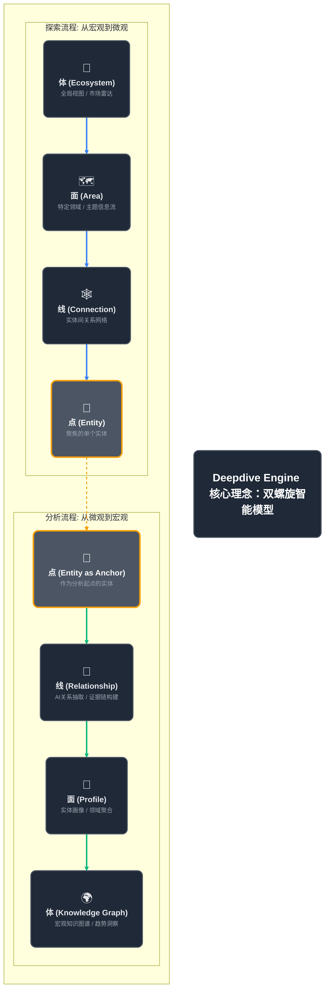
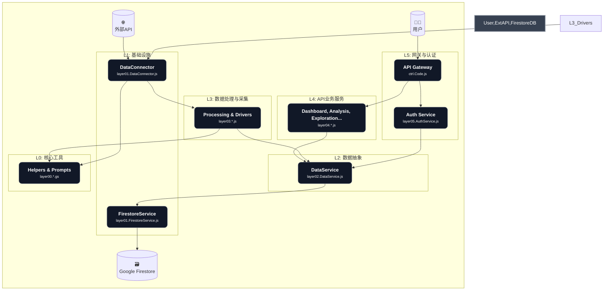
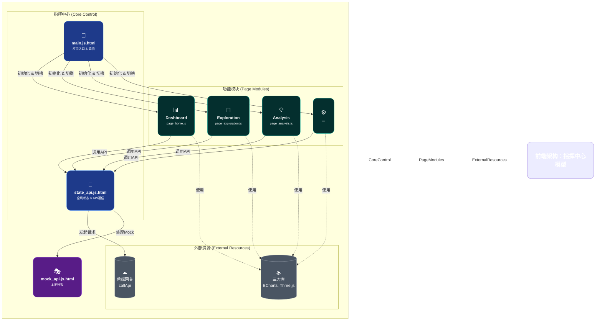

---

### **图1：核心理念 - “双螺旋”智能引擎模型**

这张图将“探索”与“分析”两个流程比作DNA的双螺旋结构，它们相互缠绕，共同构成了以“实体”为核心的智能系统。这种结构既美观，又能形象地表达两个流程的对立统一和协同进化。

**图解:**

*   **双螺旋结构:** 左侧蓝色为用户的“探索”路径，右侧绿色为系统的“分析”路径。两者并行但方向相反，形象地展示了Top-Down与Bottom-Up的对偶关系。
*   **视觉化节点:** 每个节点都加入了大号Emoji图标和多行文本，使得每个阶段的含义更加直观易懂。
*   **核心枢纽:** 中间的“点 (Entity)”节点被突出显示，并通过虚线连接两个流程，强调了实体作为核心枢纽的关键作用。
*   **美学提升:** 使用了更柔和的背景色、圆角卡片、以及更具设计感的字体和颜色搭配。

---

### **图2：后端架构 - “洋葱模型”**

这张图将后端分层架构描绘成一个洋葱模型，从外到内分别是用户交互层、业务逻辑层、数据处理层和基础设施层，核心是数据存储。这种模型能非常直观地表达层级关系和依赖方向。

**图解:**

*   **洋葱模型:** 从外层（L5）到内层（L0），清晰展示了依赖关系。外层可以调用内层，但内层不能调用外层。
*   **颜色区分:** 每一层都用不同的颜色高亮，增强了视觉上的区分度。
*   **核心路径:** 用箭头清晰地标示出用户请求（从上到下）和后台数据处理（从右到左）两条主要的数据流路径。
*   **图标化:** 外部依赖和数据库都使用了图标，使其更易于识别。

---

### **图3：前端架构 - “指挥中心”模型**

这张图将前端的核心模块 `main.js` 和 `state_api.js` 描绘成一个指挥中心，它负责调度各个页面模块，并作为与后端通信的唯一通道。

**图解:**

*   **指挥中心:** `main.js` 和 `state_api.js` 被形象地置于中心位置，体现了它们在应用中的核心调度和通信作用。
*   **模块化布局:** 各个页面模块像卫星一样围绕着指挥中心，它们是独立的，但都接受指挥中心的调度。
*   **清晰的依赖关系:** 实线箭头表示强依赖和调用关系（如页面模块必须通过`StateAPI`调用后端），虚线箭头表示弱依赖或使用关系（如页面模块使用第三方库进行渲染）。
*   **模拟/真实分离:** `StateAPI` 到 `Backend` 和 `MockAPI` 的两条路径清晰地展示了前端如何在不同环境下切换数据源。

希望这些经过美化和重构的图示能更生动、更直观地传达您项目的核心设计理念和精妙架构。
