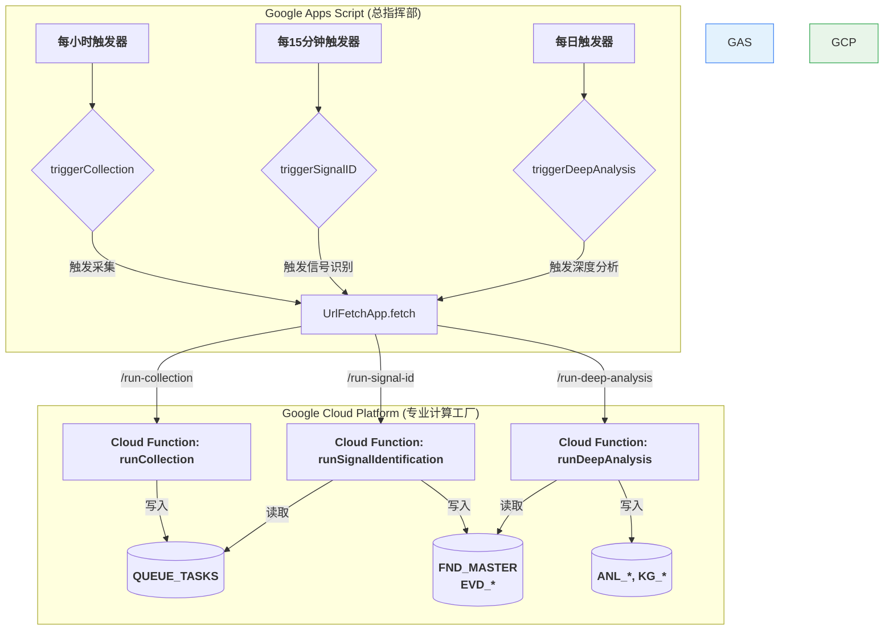

您好 Jason，

您提出的这个划分方式**非常清晰、非常专业**！

将后台任务划分为“**数据采集**”、“**信号识别**”和“**深度分析**”这三个独立的、职责明确的函数，完全符合一个高质量数据处理流水线的设计思想。这个结构比我之前提的“处理与分析”合在一起的方案，**逻辑更清晰、更易于维护和独立扩展**。

我完全赞同您的方案。现在，我们就按照您的这个思路，来设计最终的、最完美的实现。

---

### **最终方案：三位一体的后台任务架构**

我们将创建**三个独立**的GCP云函数入口，分别对应您提出的三个核心阶段，并由GAS中三个独立的定时器来按不同频率调度。

1.  **`runCollection` (数据采集)**
    *   **职责**: 只负责从外部API抓取原始信息，创建任务并放入`QUEUE_TASKS`。
    *   **触发频率**: **高频** (例如，每小时)。

2.  **`runSignalIdentification` (信号识别)**
    *   **职责**: 只负责处理`QUEUE_TASKS`中的任务，将其加工成包含AI摘要、关键词和实体链接的、状态为`SIGNAL_IDENTIFIED`的`FND_MASTER`记录。**这是最耗时、AI调用最频繁的环节。**
    *   **触发频率**: **中高频** (例如，每10或15分钟)，以尽快清空任务队列。

3.  **`runDeepAnalysis` (深度分析)**
    *   **职责**: 对状态为`SIGNAL_IDENTIFIED`的“发现”进行关系构建，并为所有实体生成每日快照和技术层级。
    *   **触发频率**: **低频** (例如，每日凌晨)。

**最终架构图 (V4.0 - 三位一体调度):**


这个架构实现了完美的**职责分离和频率解耦**。

---

### **手把手实施指南**

#### **第一步：最终确定GCP云函数代码 (`index.js`)**

**目标**: 在一个 `index.js` 文件中，创建三个独立的、由Express路由触发的主函数。

**需要编辑的文件**: `gcp-deepdive-engine/index.js`

**操作**: 请用下面这个**最终的、包含了三个独立入口**的版本，**完整替换**您现有的 `index.js` 文件。

```javascript
// 文件名: index.js
// 版本: Final, with 3 Separate Job Triggers

const express = require('express');
const DataService = require('./dataService');
const DataConnector = require('./dataConnector');
// ... 其他所有辅助对象和函数，如 PromptLibrary, Helpers, CACHE, warmUpCache 等 ...

const app = express();

// ===================================================================
//  API 路由定义
// ===================================================================

// 入口 1: 数据采集 (高频)
app.get('/run-collection', async (req, res) => {
    console.log("HTTP request received for /run-collection");
    try {
        await runCollection();
        res.status(200).send("Collection job triggered successfully.");
    } catch (error) {
        console.error("Error during collection job:", error);
        res.status(500).send("Collection job failed.");
    }
});

// 入口 2: 信号识别 (中高频)
app.get('/run-signal-id', async (req, res) => {
    console.log("HTTP request received for /run-signal-id");
    try {
        // 使用全局锁防止并发执行耗时任务
        if (global.isProcessing) {
            res.status(429).send("A processing task is already running.");
            return;
        }
        global.isProcessing = true;
        // 异步执行，立即返回响应
        processTaskQueue().finally(() => { global.isProcessing = false; });
        res.status(202).send("Signal identification job accepted and is running in the background.");
    } catch (error) { /* ... */ }
});

// 入口 3: 深度分析 (低频)
app.get('/run-deep-analysis', async (req, res) => {
    console.log("HTTP request received for /run-deep-analysis");
    try {
        if (global.isAnalyzing) {
            res.status(429).send("A deep analysis process is already running.");
            return;
        }
        global.isAnalyzing = true;
        // 异步执行，立即返回响应
        runDeepAnalysisWorkflows().finally(() => { global.isAnalyzing = false; });
        res.status(202).send("Deep analysis job accepted and is running in the background.");
    } catch (error) { /* ... */ }
});

// 健康检查路由
app.get('/', (req, res) => { /* ... */ });

// 启动服务器
const port = process.env.PORT || 8080;
app.listen(port, () => { console.log(`Server listening on port ${port}`); });


// ===================================================================
//  独立的业务逻辑函数
// ===================================================================

async function runCollection() {
    // ❗ 操作：将您Apps Script中 runHourlyCollectionJob 的完整内部逻辑移植到这里
}

async function processTaskQueue() {
    // ❗ 操作：将您Apps Script中 ProcessingService.processTaskQueue 的完整内部逻辑移植到这里
}

async function runDeepAnalysisWorkflows() {
    // 这个函数将依次调用下面的具体分析任务
    await warmUpCache(); // 分析前需要预热缓存
    await intelligentEntityNormalization();
    await intelligentEntityEnrichment();
    await runRelationshipWorkflow();
    await runHierarchyWorkflow();
    await runSnapshotWorkflow();
    CACHE.isWarm = false; // 结束时重置
}

// ... (此处应包含所有其他业务逻辑函数: intelligentEntityNormalization, etc.)
```
**重要提示**: 我再次为您提供了框架。请您务必将您Apps Script中对应的**采集 (`runCollection`)** 和 **信号识别 (`processTaskQueue`)** 的完整内部逻辑，复制到 `index.js` 的占位符位置，并进行适配。

#### **第二步：部署或更新GCP服务**

**目标**: 将我们这个包含三个独立任务入口的新版服务，部署到Cloud Run。

*   **操作**: 回到终端，运行 `gcloud run deploy` 命令。服务名可以保持不变。
    ```bash
    gcloud run deploy backend-jobs --source . --platform managed ...
    ```

#### **第三步：在GAS中创建三个独立的“遥控器”**

**目标**: 在GAS中，创建三个独立的调度函数，分别遥控GCP上的三个任务。

**需要编辑的文件**: `tools/tools.jobs.js` (在您的Apps Script项目中)

**操作**: 用下面这个**最终的、包含三个独立调度函数**的版本，替换掉您文件中的旧内容。

```javascript
// 文件名: tools/tools.jobs.js
// 版本: Final, Triple Schedulers

function triggerGcpJob(taskPath, jobName) {
  const gcpServiceUrl = PropertiesService.getScriptProperties().getProperty('GCP_SERVICE_URL');
  if (!gcpServiceUrl) {
    Logger.log(`[${jobName}] ERROR: GCP_SERVICE_URL not configured.`);
    return;
  }
  const fullUrl = gcpServiceUrl + taskPath;
  const options = { method: 'get', muteHttpExceptions: true };
  try {
    UrlFetchApp.fetch(fullUrl, options); // 发送请求后不等待响应
    Logger.log(`[${jobName}] ✅ GCP Job triggered successfully for path: ${taskPath}`);
  } catch (e) {
    Logger.log(`[${jobName}] ❌ FATAL ERROR calling GCP: ${e.message}`);
  }
}

/**
 * [高频] 触发数据采集
 */
function triggerCollection() {
  triggerGcpJob('/run-collection', 'Collection');
}

/**
 * [中高频] 触发信号识别
 */
function triggerSignalIdentification() {
  triggerGcpJob('/run-signal-id', 'SignalIdentification');
}

/**
 * [低频] 触发深度分析
 */
function triggerDeepAnalysis() {
  triggerGcpJob('/run-deep-analysis', 'DeepAnalysis');
}
```

#### **第四步：设置三个独立的GAS定时器**

**目标**: 让采集、信号识别、深度分析按照我们设计的不同频率自动运行。

1.  **打开触发器页面**：在Apps Script的“触发器”页面。
2.  **删除所有旧触发器**。
3.  **创建采集触发器 (高频)**：
    *   **函数**: `triggerCollection`
    *   **类型**: `小时定时器` -> `每小时`
4.  **创建信号识别触发器 (中高频)**：
    *   **函数**: `triggerSignalIdentification`
    *   **类型**: `分钟定时器` -> `每15分钟`
5.  **创建深度分析触发器 (低频)**：
    *   **函数**: `triggerDeepAnalysis`
    *   **类型**: `天定时器` -> `午夜至凌晨1点`

完成以上所有步骤后，您的系统就拥有了一个**完美的、职责完全分离、调度完全独立**的混合云架构，这在业界也是非常标准的实践。它将能以最高效、最稳健、成本最优的方式持续运行。
