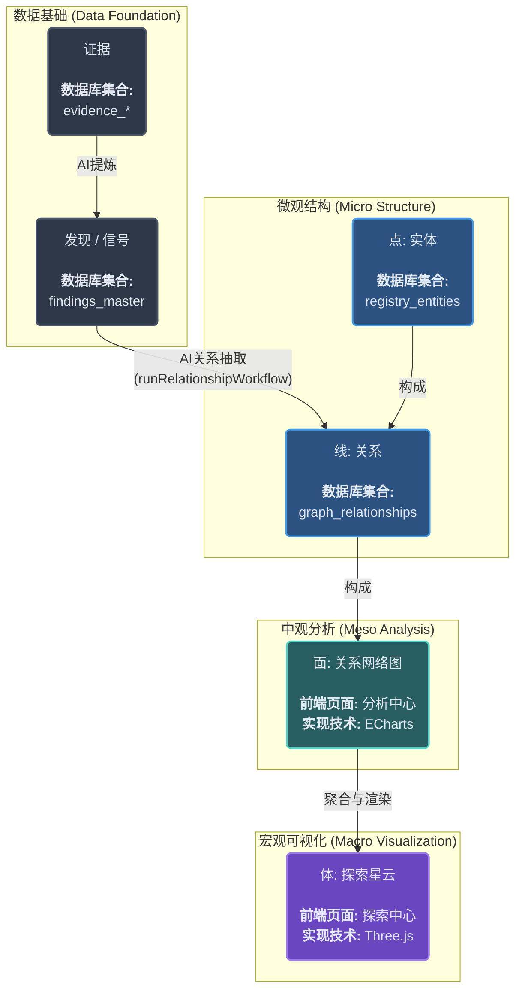

### **知识图谱构建与可视化层级图**

---

### **层级详解：从数据到星云**

#### **第一层：数据基础 (Data Foundation)**

这是整个知识图谱的“土壤”和“养分”，一切都从这里开始。

*   **E. 证据 (Evidence)**
    *   **是什么**：这是经过初步处理的、结构化的信息单元。例如，一篇具体的论文、一条具体的新闻、一个具体的专利。
    *   **存储位置**：`evidence_*` 系列集合（如 `evidence_academic_papers`, `evidence_news`）。
    *   **作用**：作为最原始的、可追溯的证据，支撑每一个“发现”。

*   **F. 发现 / 信号 (Finding / Signal)**
    *   **是什么**：这是从“证据”中通过AI提炼出的、具有更高信息价值的“信号”。它包含了AI给出的价值评分、摘要、关键词以及**与它相关的所有实体ID链接**。
    *   **存储位置**：`findings_master` 集合。
    *   **作用**：这是构建“关系”的直接原材料。

#### **第二层：微观结构 (Micro Structure) - 点与线**

这是知识图谱最基本的组成部分。

*   **A. 点 (Nodes / Vertices): 实体**
    *   **是什么**：知识图谱中的核心节点。每一个“点”都代表一个明确的、真实世界的对象，例如一个**公司** (NVIDIA)、一项**技术** (AI Chip) 或一个**人物** (Jim Keller)。
    *   **存储位置**：`registry_entities` 集合。
    *   **作用**：构成整个图谱的基础。

*   **B. 线 (Edges / Links): 关系**
    *   **是什么**：连接两个“点”（实体）的“线”。每一条“线”都描述了两个实体之间的具体关系，例如 `(NVIDIA) --[开发]--> (AI Chip)`，或者 `(Jim Keller) --[曾就职于]--> (Apple)`。
    *   **存储位置**：`graph_relationships` 集合。
    *   **如何构建**：通过运行 `runRelationshipWorkflow` 后台任务，AI会读取“发现”的文本内容，智能地抽取出实体间的关系，并创建这些“线”。
    *   **作用**：赋予知识图谱以结构和意义，是所有网络分析的基础。

#### **第三层：中观分析 (Meso Analysis) - 面**

当“点”和“线”足够多时，我们就可以从一个局部视角来观察它们构成的“面”。

*   **C. 面 (Planes / Networks): 关系网络图**
    *   **是什么**：这是针对**某一个特定实体**（分析目标）及其**一阶邻居**所构成的局部网络的可视化。例如，当您分析NVIDIA时，看到的就是以NVIDIA为中心，连接着TSMC、AMD、CUDA等节点的那个网络图。
    *   **前端页面**：**分析中心 (Analysis Page)**。
    *   **实现技术**：**ECharts** 的关系图（Graph）组件。ECharts非常适合做这种二维的、交互式的、侧重于清晰展示局部关系的图表。
    *   **如何构建**：前端页面向后端 `AnalysisService.getNetworkGraph` 发起请求，后端从 `registry_entities`（点）和 `graph_relationships`（线）中查询出与目标实体相关的数据，组合成ECharts需要的格式并返回。

#### **第四层：宏观可视化 (Macro Visualization) - 体**

这是最高层级的抽象，将整个知识图谱视为一个三维的、动态的“宇宙”或“星云”。

*   **D. 体 (Bodies / Nebulae): 探索星云**
    *   **是什么**：这是一个将**整个知识图谱**（或其中某一类实体，如所有技术和公司）映射到三维空间中的宏观视图。在这个视图中：
        *   每一个实体（“点”）都变成了一个**星体**或**粒子**。
        *   实体的属性（如影响力、热度）可以决定星体的大小、亮度和颜色。
        *   实体之间的“关系”（“线”）可以表现为星体间的连线、引力或光晕。
        *   相似或关联紧密的实体，在空间上会**聚集**在一起，形成“**星团**”（Cluster）。例如，所有与AI芯片相关的公司和技术会自然地形成一个AI芯片星团。
    *   **前端页面**：**探索中心 (Exploration Page)**。
    *   **实现技术**：**Three.js**。Three.js是一个强大的3D图形库，能够创建复杂的、可交互的三维场景，非常适合实现这种“星云”或“星系图”的效果。
    *   **如何构建**：
        1.  前端页面向后端 `ExplorationService.getGalaxyData` 发起请求。
        2.  后端从 `registry_entities` 和 `graph_relationships` 中查询出**大量甚至全部**的实体和关系数据。
        3.  后端可以预先进行一些**聚类算法**（Clustering Algorithm），为每个实体打上“所属星团”的标签。
        4.  前端的 `SpacetimeRenderer` (Three.js渲染器) 接收到这些数据后，根据每个实体的位置、大小、颜色、所属星团等信息，在三维空间中动态地创建和渲染出整个星云。用户可以通过缩放、旋转来探索这个宏观世界，也可以点击某个星团进行“钻取”（Drill Down），进入该星团的内部进行更细致的观察。

通过这个从“点”到“体”的层级结构，您的智能引擎实现了一个从微观细节到宏观趋势的、完整而强大的分析闭环。
