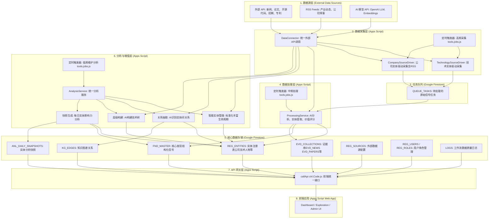
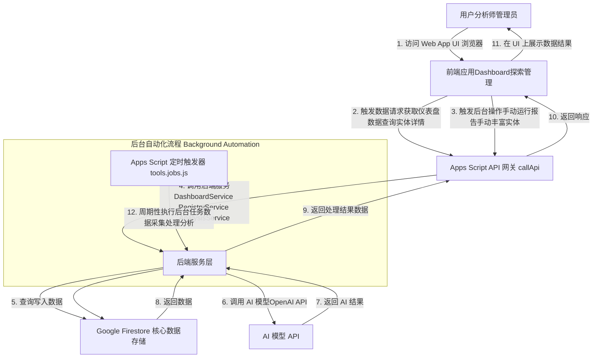

## **优化后的 Markdown 文档**

### **1. 系统的整体架构**

本系统是一个基于 Google Apps Script 和 Google Cloud Firestore 构建的模块化、AI 驱动的技术信号与知识管理平台。它旨在自动化从海量非结构化数据中提取、处理、分析和管理有价值的技术与商业信号。

### **2. 系统的整体交互架构**

本系统的交互架构主要围绕用户与前端应用，以及前端应用通过统一的 API 网关与后端服务进行数据交换。后台任务则由定时触发器驱动，独立于用户交互运行。

### **3. 系统的关键价值、与人及其他系统的对比**

本系统通过深度自动化和AI赋能，在技术信号的获取、处理和分析方面展现出独特优势。

| 特性/维度 | 本系统 (AI驱动技术信号系统) | 人工分析师团队 | 传统BI/ETL平台 | 通用市场研究报告 |
|:----------|:---------------------------|:---------------|:---------------|:-----------------|
| **数据来源** | 多源异构、实时/近实时 (API, RSS, 非结构化文本) | 有限、人工收集、滞后、高成本 | 结构化数据库、内部系统、预设数据流 | 周期性、人工调研、特定主题 |
| **信号提取** | **AI自动**从非结构化文本中提取结构化信号 (实体、关系、评分、关键词、摘要) | 耗时、人工阅读、主观性强、易遗漏 | 需预定义规则、人工建模、主要针对结构化数据 | 预设主题、专家分析、缺乏灵活性 |
| **处理速度** | **高速、自动化、24/7**、秒级/分钟级响应 | 慢、受限于人力、非持续 | 批处理或近实时、主要针对清洗转换 | 周期性发布 (周报/月报/年报) |
| **规模化** | 易于扩展、处理**海量非结构化数据** | 难以规模化、成本呈线性增长 | 擅长结构化数据规模化、非结构化数据处理能力弱 | 报告数量有限、无法定制 |
| **一致性** | **高度一致、可复现** (AI模型和规则驱动) | 易受个体经验/偏好影响、结果不一 | 高度一致 (规则驱动) | 专家经验、有主观性 |
| **成本** | 初始投入 (AI/平台)，运营成本随数据量和AI调用量变化；**长期边际成本低** | 持续高昂的人力成本 | 软件/实施成本，维护成本；主要为结构化数据 | 报告购买成本，无法自建 |
| **洞察深度** | **AI辅助深挖、关联分析、异常检测**；发现人工难以察觉的模式 | 专家经验、深度思考、但受限于数据量和速度 | 需人工分析原始数据、缺乏智能关联 | 预设结论、宏观趋势、无法交互式探索 |
| **自定义性** | **高度可定制** (Prompt/规则/数据源/实体类型) | 极高 (但效率低) | 需大量开发/配置、非AI驱动 | 有限、无法更改分析维度 |
| **偏见/主观** | AI模型可能存在偏见，但**可训练优化**；数据处理客观 | 强烈的个体主观性 | 依赖数据源和建模者 | 撰写者主观性、可能带有商业目的 |
| **应用场景** | **技术趋势发现、竞争信号、风险预警、投资分析、人才招聘洞察** | 传统市场分析、战略咨询 | 业务报告、数据仓库、内部流程优化 | 行业概览、市场预测 |

### **4. 系统的关键能力**

本系统提供了一系列集成化的关键能力，覆盖了从数据获取到智能分析的全链条。

**数据采集与多源整合能力：**

系统具备强大的多源异构数据采集能力，能够从新闻媒体、学术论文库、开源代码平台、招聘网站、专利数据库等多样化外部 API 以及 RSS Feed 中自动化、实时或近实时地获取数据。通过 Firestore `REG_SOURCES` 集合进行灵活的数据源配置和管理，支持动态调整 API 端点、认证方式、请求参数和响应映射规则。

系统利用实体（公司、技术）的 `search_keywords`、`primary_name` 和 `aliases` 动态构建查询，确保采集到的信息与关注目标高度相关。针对外部 API 的速率和请求限制，采用分块查询优化策略，提高采集效率和稳定性。

**AI 驱动的非结构化数据处理能力：**

系统的核心能力在于将海量的非结构化文本（如新闻摘要、论文摘要）通过 AI (LLM) 自动转换为结构化、可分析的数据格式。系统能够自动化进行多维度信息提取，包括文章的摘要、关键词，并识别和归类其中提及的各种实体（公司、技术、人物、事件等）。

通过 AI 对每条信号进行 `value_score` 评估，量化其战略重要性，帮助用户聚焦高价值信息。系统采用 `QUEUE_TASKS` 队列机制，实现数据采集与后续处理的解耦，确保数据流的稳定性和弹性。

**核心知识管理与实体生命周期能力：**

系统建立了统一实体注册表，将所有关注的实体（公司、技术、人物、事件、概念等）统一存储在 `REG_ENTITIES` 集合中，为所有分析提供统一的基础。系统具备智能实体标准化与合并功能，利用 AI 驱动的实体消歧技术，识别并合并重复的、别名不同的实体名称，确保每个现实世界实体在系统中拥有唯一的 `entity_id` 和 `primary_name`，同时自动收集和维护实体的 `aliases` 列表。

系统提供 AI 驱动的实体信息丰富功能，利用 AI 为实体自动补全缺失的描述、类别 (`category`, `sub_type`)、联系方式 (如 `website`)、地理位置 (如 `headquarters`)、关键指标 (如 `stock_symbol`) 等属性。系统为所有实体生成统一的 `search_keywords` 列表，优化未来数据采集的精确性，并通过 `monitoring_status` (pending_review → normalized → enriched → active) 追踪实体从创建到活跃监控的全过程，支持人工审核介入。

**深度分析与洞察生成能力：**

系统具备知识图谱构建能力，通过 AI 关系抽取技术从处理后的信号中自动识别实体之间的语义关系，并构建知识图谱的边 (`KG_EDGES`)。系统能够进行 AI 辅助的技术层级构建，形成技术树结构。

系统提供动态趋势分析功能，能够基于实体的历史数据和最新发现，生成趋势图和影响力分数，揭示市场动态和技术发展方向。系统定期生成实体的每日分析快照 (`ANL_DAILY_SNAPSHOTS`)，提供宏观洞察，并将高价值的结构化信号存储为"核心发现" (`FND_MASTER`)，可追溯其原始证据链。系统还具备 AI Copilot 扩展能力，提供自然语言交互界面，利用 LLM 进行深度研究、报告生成和复杂查询。

**平台化与可扩展性能力：**

系统采用清晰的分层和模块化设计（数据采集驱动器、处理服务、分析服务等），降低了复杂性，提高了代码的可维护性和可扩展性。系统利用 Google Apps Script 的优势，实现与 Google Workspace 服务的无缝集成，简化部署和管理。

系统的关键业务逻辑和数据源通过 Firestore 配置驱动，支持灵活调整和快速迭代。`callApi` 函数作为前端与后端服务的统一 API 网关，简化了前端开发。系统配备完善的日志系统，便于追踪任务执行、数据流转和错误排查。
