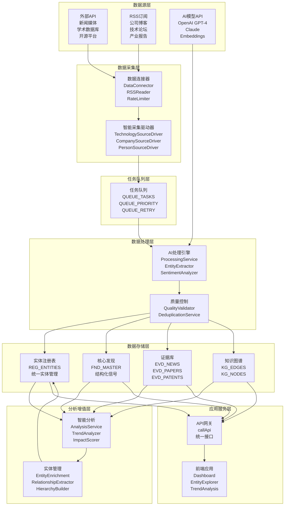
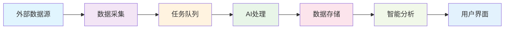
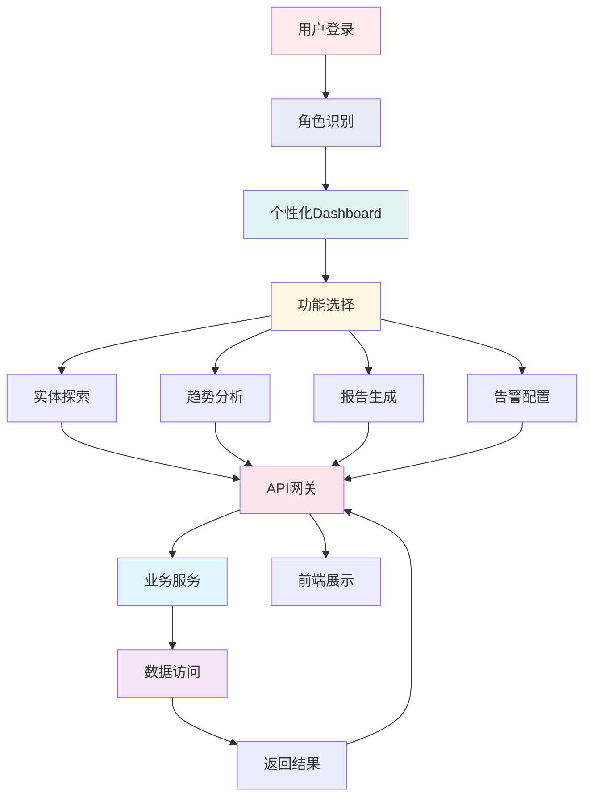
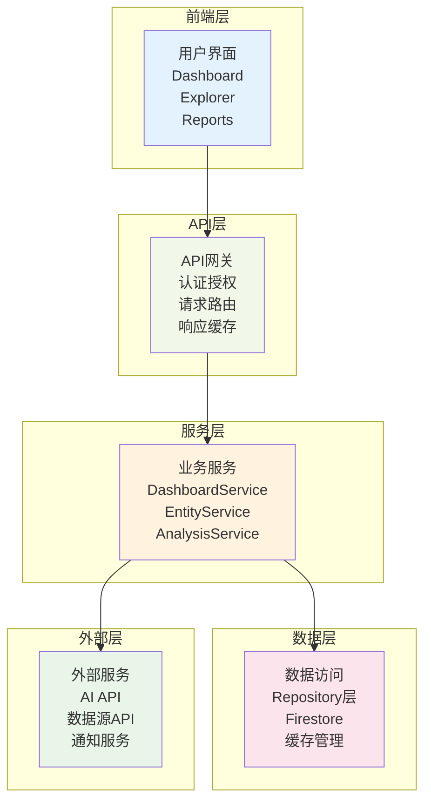
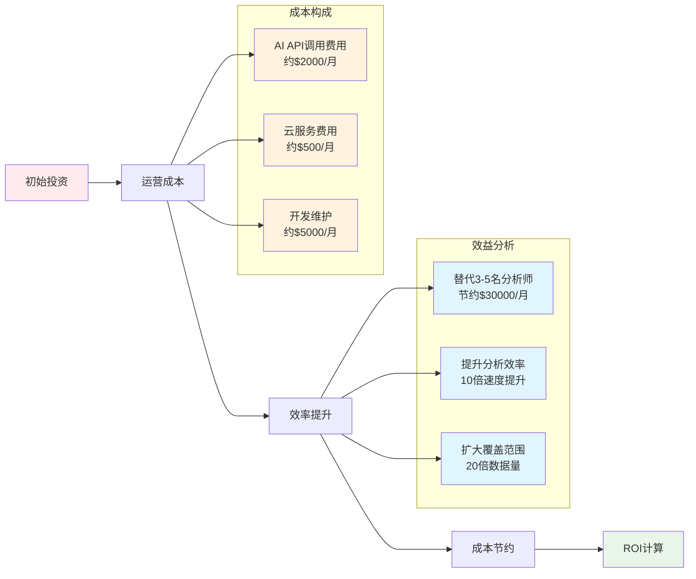
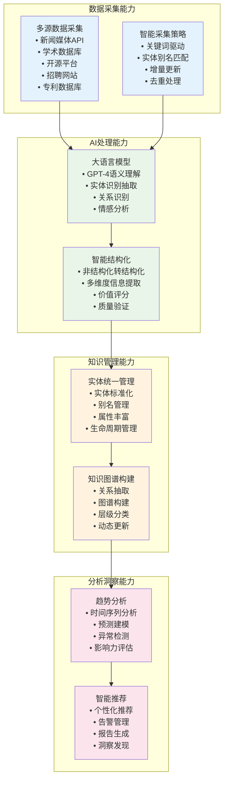
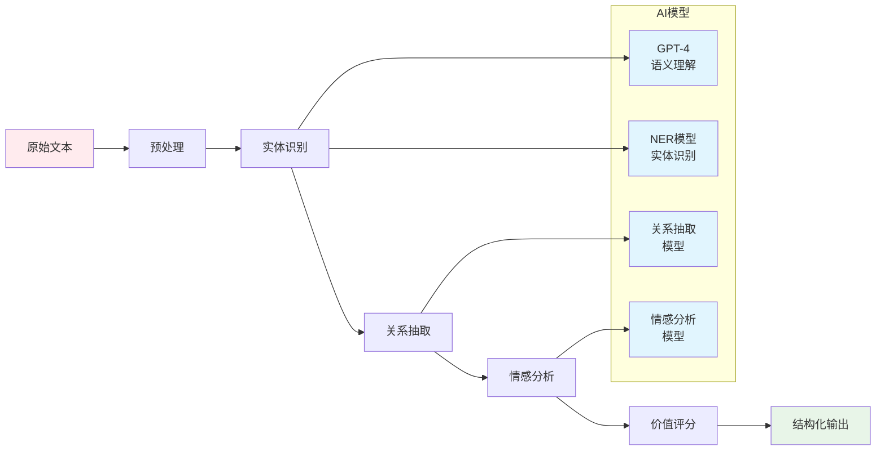

## **系统概述：AI 驱动的技术信号与知识管理平台**

### **1. 系统的整体架构**

本系统是一个基于 Google Apps Script 和 Google Cloud Firestore 构建的模块化、AI 驱动的技术信号与知识管理平台。它旨在自动化从海量非结构化数据中提取、处理、分析和管理有价值的技术与商业信号，为企业和投资机构提供深度的技术趋势洞察和竞争情报。

**系统整体架构图：**

**数据流向图：**

### **2. 系统的整体交互架构**

本系统的交互架构采用多层次、多角色的设计模式，支持不同用户角色的差异化需求，同时确保系统的高可用性和响应性能。

**用户交互流程图：**

**系统服务架构图：**

### **3. 系统的关键价值与竞争优势对比**

本系统通过深度自动化和AI赋能，在技术信号的获取、处理和分析方面展现出独特优势，相比传统方法和竞争方案具有显著的技术领先性和商业价值。

**核心优势对比表：**

| 评估维度 | 本系统 | 人工分析师 | 传统BI平台 | 市场研究报告 |
|:---------|:-------|:----------|:----------|:------------|
| **数据获取** | ✅ 20+数据源自动采集 ✅ 实时/准实时更新 ✅ 智能关键词驱动 | ❌ 人工搜索收集 ❌ 更新滞后 ❌ 覆盖面有限 | ⚠️ 主要内部数据 ⚠️ 外部集成有限 ⚠️ 需预定义流程 | ❌ 周期性调研 ❌ 数据获取慢 ❌ 覆盖面窄 |
| **处理能力** | ✅ AI自动结构化 ✅ 多维度信息提取 ✅ 智能质量控制 | ⚠️ 深度分析能力强 ❌ 效率低成本高 ❌ 主观性强 | ⚠️ 数据清洗转换 ❌ 缺乏语义理解 ❌ 需人工配置 | ⚠️ 专家深度分析 ❌ 处理量有限 ❌ 分析角度固定 |
| **响应速度** | ✅ 分钟级采集 ✅ 秒级查询 ✅ 24/7运行 | ❌ 响应缓慢 ❌ 工作时间限制 ❌ 人力瓶颈 | ⚠️ 批处理为主 ⚠️ 实时性有限 ⚠️ 处理延迟高 | ❌ 周期性更新 ❌ 季度/年度发布 ❌ 无法及时响应 |
| **规模化** | ✅ TB级数据处理 ✅ 千万级实体 ✅ 弹性扩展 | ❌ 线性成本增长 ❌ 人力资源瓶颈 ❌ 质量一致性差 | ⚠️ 结构化数据擅长 ❌ 非结构化处理弱 ⚠️ 扩展成本高 | ❌ 报告数量有限 ❌ 无法个性化 ❌ 成本高昂 |
| **智能化** | ✅ GPT-4语义理解 ✅ 自动实体识别 ✅ 预测分析 | ⚠️ 人工智能经验 ❌ 无法处理海量数据 ❌ 扩展性差 | ❌ 规则驱动 ❌ 缺乏AI能力 ❌ 需人工配置 | ⚠️ 专家智能 ❌ 无法自动化 ❌ 方法固定 |

**投资回报率分析：**

### **4. 系统的核心技术能力**

本系统构建了一个完整的技术信号处理生态系统，通过多层次的技术架构和AI驱动的智能化处理，实现了从数据采集到洞察生成的全链条自动化。

**技术能力架构图：**

**AI处理流程图：**

**多源异构数据采集与整合能力：**

系统建立了覆盖全球主要技术和商业信息源的数据采集网络，包括新闻媒体（TechCrunch、路透社、Bloomberg）、学术数据库（arXiv、PubMed、IEEE Xplore）、开源平台（GitHub、GitLab）、招聘网站（LinkedIn、Indeed）、专利数据库（USPTO、EPO）、社交媒体（Twitter、Reddit、HackerNews）等20多个不同类型的数据源。

系统采用智能关键词驱动的采集策略，基于实体的 search_keywords、primary_name 和 aliases 动态构建查询条件，确保采集到的信息与关注目标高度相关。通过 DataConnector 统一管理外部API调用，实现了标准化的数据接口和错误处理机制。RateLimiter 组件确保API调用遵循各数据源的速率限制，避免被封禁的风险。

**AI驱动的智能数据处理与结构化能力：**

系统的核心优势在于利用大语言模型（GPT-4、Claude等）将海量非结构化文本自动转换为结构化、可分析的数据格式。ProcessingService 作为核心处理引擎，集成了多个AI服务组件，包括实体识别（NERService）、情感分析（SentimentAnalyzer）、内容摘要（ContentSummarizer）、智能分类（ClassificationService）等。

EntityExtractor 能够从复杂的文本中识别和提取公司、技术、人物、事件、概念等多种类型的实体，并自动建立它们之间的关联关系。系统通过 PromptManager 管理各种AI任务的提示词模板，确保处理结果的一致性和准确性。

**统一实体管理与知识图谱构建能力：**

系统建立了统一的实体注册表（REG_ENTITIES），作为所有分析和处理的基础数据层。EntityNormalizationService 利用AI技术进行实体消歧和标准化，确保同一现实世界实体在系统中拥有唯一的标识符和标准名称。系统自动维护实体的别名列表，处理不同语言、不同表述方式的实体名称。

RelationshipExtractor 从处理后的信号中自动识别实体之间的各种关系，包括竞争关系、合作关系、投资关系、技术依赖关系等，构建知识图谱的边（KG_EDGES）。HierarchyBuilder 利用AI构建技术实体之间的层级关系，形成技术树和分类体系。

**深度分析与智能洞察生成能力：**

TrendAnalyzer 基于历史数据和实时信号，利用时间序列分析和机器学习算法，生成技术趋势预测和市场动态分析。系统能够识别技术的生命周期阶段、发展速度、影响范围等关键指标。

ImpactScorer 通过综合考虑实体的媒体曝光度、学术影响力、市场表现、社交媒体热度等多个维度，计算实体的综合影响力评分。AnomalyDetector 能够识别异常的信号模式，及时发现突发事件、技术突破、市场变化等重要信息。

**平台化架构与扩展能力：**

系统采用模块化和微服务化的设计理念，各个组件之间通过标准化接口进行交互，便于维护和扩展。基于Google Apps Script和Firestore的云原生架构，确保了系统的高可用性和弹性扩展能力。

统一的API网关（callApi）提供了标准化的前端接口，支持身份认证、权限控制、请求路由、响应缓存等功能。完善的日志系统记录了系统的各种操作和状态，便于监控和故障排查。
