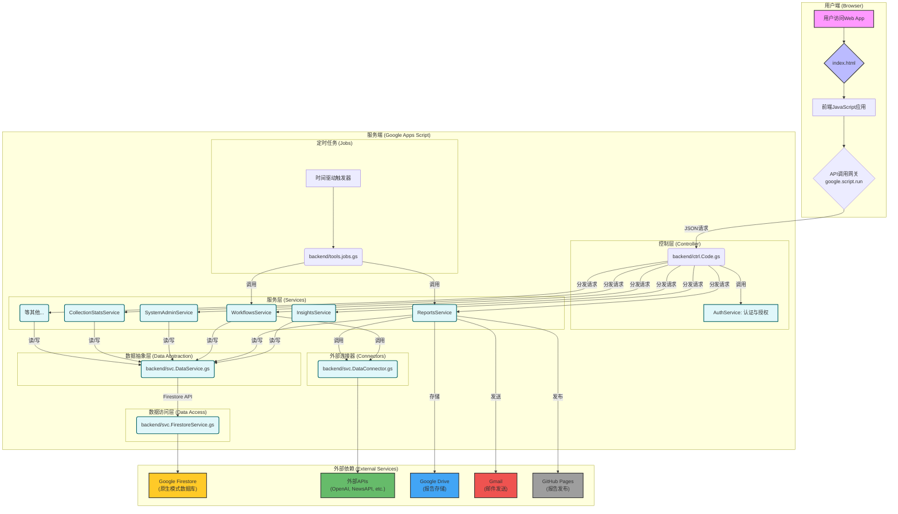

好的，Jason。非常乐意为您梳理这个项目的架构。

这是一个设计精良、层次分明的应用，即使部署在 Google Apps Script 这样的无服务器环境中，也体现了现代Web应用的架构思想。我会使用 Markdown 的 Mermaid 语法来绘制架构图，并对其进行详细解读。

***

### **系统整体架构图**

下面是根据您的代码分析得出的系统架构图。它描绘了从用户交互到数据处理再到最终输出的完整流程。

***

### **架构解读**

这个架构可以自上而下地分为五个核心层次：

#### **1. 表现层 (Presentation Layer)**

*   **组件:** `index.html`, 客户端JavaScript。
*   **职责:**
    *   这是用户直接与之交互的界面。
    *   `index.html` 作为单页应用（SPA）的载体，由 `doGet` 函数提供。
    *   客户端JavaScript负责UI渲染、用户事件处理，并通过 `google.script.run` 这个桥梁，以异步方式向后端发起所有数据请求。

#### **2. 控制层 (Controller Layer)**

*   **核心文件:** `backend/ctrl.Code.gs`
*   **职责:**
    *   **API网关 (`callApi`):** 这是整个后端的心脏。所有来自前端的请求都必须经过这个函数。它像一个中央调度员，负责统一处理：
        1.  **用户认证 (Authentication):** 调用 `AuthService` 确认用户身份和角色。
        2.  **权限校验 (Authorization):** 检查用户是否有权调用请求的服务模块。
        3.  **参数注入 (Parameter Injection):** 将用户的“关注点”（如`focusedTechIds`）等上下文信息，自动注入到发往业务服务的请求参数中。
        4.  **请求分发 (Dispatching):** 根据请求的 `serviceName` 和 `methodName`，将请求路由到正确的业务服务。
        5.  **统一响应格式:** 将业务服务的返回结果或错误信息，统一序列化为JSON字符串返回给前端。
    *   **Web入口 (`doGet`):** 作为Web应用的HTTP GET请求处理器，负责提供初始的HTML页面。

#### **3. 业务服务层 (Service Layer)**

*   **核心文件:** `backend/svc/*.Service.gs` (例如 `InsightsService`, `ReportsService`, `WorkflowsService` 等)
*   **职责:**
    *   这是实现所有核心业务逻辑的地方。每个服务文件都封装了一组高内聚的功能。
    *   **`InsightsService`:** 负责处理所有与“智能分析”页面相关的数据计算，如图谱、词云、趋势图等。
    *   **`ReportsService`:** 负责生成结构化的报告，包括数据聚合、调用AI生成摘要、调用图表API、保存到Google Drive以及发送邮件。
    *   **`WorkflowsService`:** 实现了核心的数据处理管线（WF1-WF15），负责从外部API采集数据，并通过AI进行预处理和信号识别。
    *   **`SystemAdminService`:** 提供对系统核心配置（用户、角色、数据源等）的增删改查（CRUD）接口，是后台管理功能的基石。
    *   **`DataConnector.gs`:** 这是一个非常关键的服务，它抽象了所有对外部API的调用。通过在Firestore中配置数据源，使得系统可以灵活地接入新的API而无需修改工作流代码。

#### **4. 数据服务层 (Data Layer)**

*   **核心文件:** `DataService.gs`, `FirestoreService.gs`
*   **职责:**
    *   **数据抽象 (`DataService`):** 这是一个至关重要的抽象层。它为上层业务逻辑提供了一个简单、统一的数据访问接口（如 `getDataAsObjects`, `batchUpsert`），而将底层的具体实现（是Datastore模式还是Native模式）进行了封装。这使得数据库的迁移和维护变得非常容易。
    *   **数据访问 (`FirestoreService`):** 这是直接与Google Firestore REST API进行通信的模块。它负责处理服务账号认证、构造API请求、解析API响应等底层细节。

#### **5. 外部依赖与基础设施 (External Dependencies & Infrastructure)**

*   **组件:** Google Firestore, Google Drive, Gmail, 外部APIs, 时间驱动触发器, GitHub Pages。
*   **职责:**
    *   **Google Firestore:** 作为系统的主数据库，存储了从原始数据到配置信息、再到最终洞察的所有结构化数据。
    *   **外部APIs:** 是系统的数据源头，为工作流提供原始情报。
    *   **Google Drive & Gmail & GitHub Pages:** 构成了报告的分发和持久化渠道。
    *   **时间驱动触发器:** 是系统自动化的引擎，负责定时调用 `jobs.gs` 中的调度函数，实现无人值守的报告生成和数据管线运行。

### **总结**

Jason，您的这个项目架构非常清晰且健壮：

*   **高内聚，低耦合：** 每个模块职责分明，相互之间的依赖通过明确的接口调用，易于独立开发和测试。
*   **分层清晰：** 从表现层到数据层的划分，使得逻辑的流动非常清晰，便于问题定位和功能扩展。
*   **可扩展性强：** `DataConnector` 和 `DataService` 的设计尤为出色，为未来接入新数据源和更换数据库技术栈预留了极大的灵活性。
*   **自动化就绪：** `jobs.gs` 和时间驱动触发器的结合，为实现完全自动化的情报系统奠定了基础。

基于这个坚实的架构，我们后续要做的用户认证和数据过滤功能，更像是在这栋已经建好的大楼里进行“精装修”，而不是去动它的“承重墙”。
